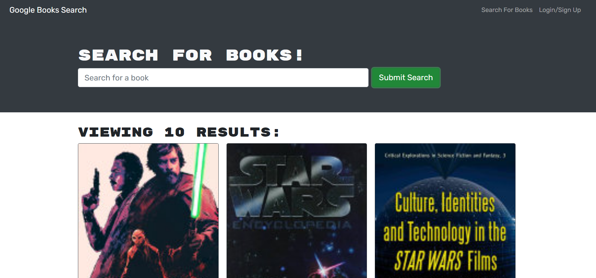

# Book Search Engine

# Description
This project enables you to search for books using a search engine, and save them to your account. The purpose of this project was to refactor the code to use graphQL instead of RESTful API's to query the database.  It enabled me to practice using GraphQL.
# Features
This app features the following components: 
* User authentication
* A search engine for searching books
* The ability to save books to your account when logged in
* The ability to view your saved books when logged in
* The ability to delete books from your saved list when logged in.

# Techologies
* GraphQL
* Node.js
* Express.js
* MongoDB
* Mongoose
* React

# Screenshots

# Links
Deployed Application: https://book-search-engine-ml.herokuapp.com/

# Credits
Miranda Lane
